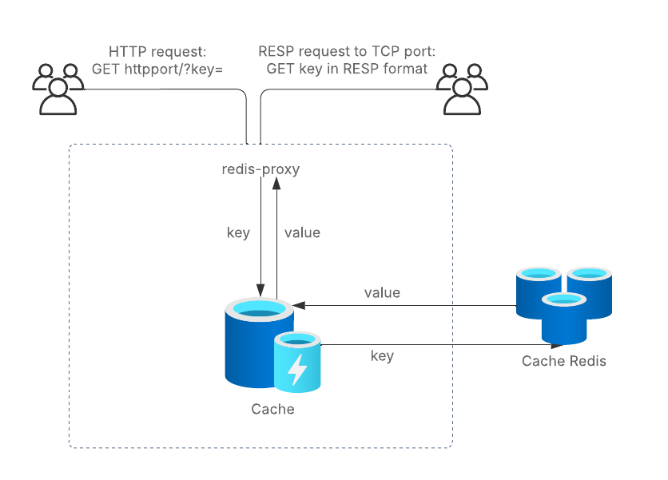

# redis-proxy

A proxy that sits between the client and the redis server. It is a simple proxy that forwards the request to the redis server and returns the response to the client.

Both http and RESP (Redis Serialization Protocol) are supported for a call to get a simple string value based on a string key.

## Architecture

## What the proxy does
- HTTP request:
  - The proxy listens on a port specified in the HTTP_ADDRESS env var for incoming requests. Note that the echo/built-in http packages in go support concurrent requests. It also supports rate limiting. It is set to 20 requests per second.
  - It checks if the key is present in the local LRU cache.
  - If the key is present in the cache, it returns the value from the cache.
  - If the key is not present in the cache, it looks for the request in redis.
  - If the key is present in redis, it returns the value from redis and updates the cache, otherwise it returns an error.

- RESP request:
  - The proxy listens on a port specified in the RESP_ADDRESS env var for incoming requests.
  - It parses the request based on the RESP protocol and returns an error if the request is not valid.
  - It then follows the steps above to find they value associated with the key.
  - It will return the response in RESP format.

## Algorithmic Complexity
Getting a value from both the LRU cache and redis is O(1) time complexity.

## How to run the proxy and associated tests
- Clone the repo and navigate to the root directory.
- Run `make test` to run the tests.
  - this will build the docker image and run the tests in the docker container.
- To run the proxy locally without docker, run `go run main.go`.
- Configurable environment variables:
  - `GLOBAL_EXPIRY_MS`: The expiry time for the LRU cache in milliseconds.
  - `KEY_SIZE`: This is the number of keys that are stored in the LRU cache.
  - `REDIS_PORT`: The port on which the redis server is running. Default is 6379.
  - `REDIS_ADDRESS`: The address of the redis server. Default is `localhost`.
  - `HTTP_ADDRESS`: The address on which the HTTP server listens.
  - `RESP_ADDRESS`: The address on which the RESP server listens.
- The http endpoint is GET `http://localhost:HTTP_ADDRESS?key=<key>`.
- As an example, the RESP endpoint can be accessed by running the following in the terminal: `echo -e "*2\r\n\$3\r\nGET\r\n\$2\r\nkey\r\n" | nc 127.0.0.1 RESP_ADDRESS`.

## How long did it take to complete the assignment?
- It took me about an hour to have the HTTP server working.
- It took me about 2-3 hours to have the RESP server working.
- It took me about 3 hours to get tests working for both the HTTP and RESP servers.
- Documentation took me about 30 mins.

## What requirements were not implemented?
- All the bonus requirements were completed, but both the rate limiter and concurrent processing were trivial thanks to Go's built-in libraries and echo.
- A custom rate limiter could be built using Go's `time.Tick` channel to limit the number of requests per second.